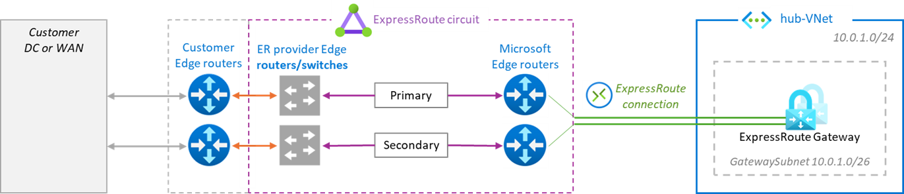
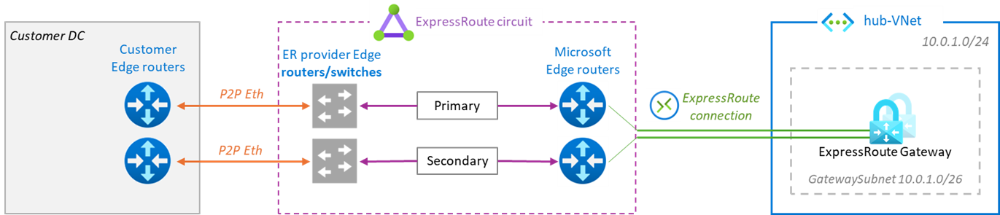
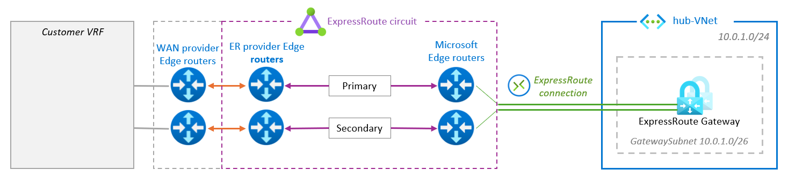
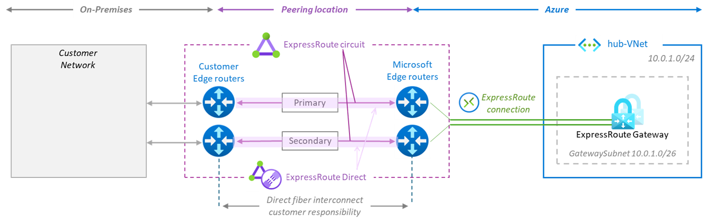

No breaking news, just an illustrated recap of the the recommendations and attention points highlighted here and there in the [Microsoft Expressroute documentation](https://learn.microsoft.com/en-us/azure/expressroute/).

# Understanding ExpressRoute to address ExpressRoute Resiliency

# 1. ExpressRoute components, architectures and data flows

This article focuses on [ExpressRoute](https://learn.microsoft.com/en-us/azure/expressroute/expressroute-introduction) Private Peering only, pused to connect an On-Prem network and VNets in an [Azure region](https://azure.microsoft.com/en-us/explore/global-infrastructure/geographies/#overview). ExpressRoute connectivity is provided in [ExpressRoute peering locations](https://learn.microsoft.com/en-us/azure/expressroute/expressroute-locations).

 ExpressRoute peering locations are entry points into the Microsoft backbone, Azure regions are where  the Azure resources are hosted: distinct concepts at different locations. 
 
## 1.1. ExpressRoute components

3 main components: the Circuit, the Gateway and the Connection.

| **Components** | **Connectivity** | **Location** |
|---|---|---|
|ExpressRoute Circuit|Dual physical fiber connectivity between the MSEEs and the provider|Expressroute peering location|
|ExpressRoute Gateway|Min 2 instances connected to both MSEEs| Azure region|
|ExpressRoute Connection|virtual connection between the MSEE and the ExpressRoute Gateway|ExpressRoute location to Azure region

The provider is required to have redundant connectivity to the customer edge or their MPLS edge.

## 1.2. ExpressRoute architectures

There are 4 [ExpressRoute connectivity models](https://learn.microsoft.com/en-us/azure/expressroute/expressroute-connectivity-models) between on-prem and Azure, split in 2 approaches: 3 ExpressRoute *Service Provider* models and 1 ExpressRoute *Direct* model.

### 1.2.1. ExpressRoute Service Provider models

in these models, ExpressRoute connectivity is provided to customers via [service providers](https://learn.microsoft.com/en-us/azure/expressroute/expressroute-locations-providers#partners) and can be delivered in 3 different ways.

#### Cloud exchange colocation

The customer edge routers are hosted **in a cloud exchange facility** close to or in the peering location and are L2 or L3 cross-connected with an ExpressRoute connectivity provider.

#### Ethernet Point to Point

The customer edge routers **at a branch** are L2 or L3 connected with an ExpressRoute connectivity provider via point-to-point Ethernet links.

#### Any-to-any connectivity

Here the ExpressRoute is mapped to a **customer VRF** of the WAN provider network, making Azure appear like any other branch connected to the customer's MPLS backbone. The ExpressRoute connectivity provider routers are cross-connected with colocated WAN service provider routers.

### 1.2.2. ExpressRoute Direct model

ExpressRoute Direct is a dedicated physical connection to the Microsoft backbone, between a pair of MSEEs and customer routers and without any intermediate connecitivity provider. The customer is allocated an entire MSEE port (10Gbps and 100Gbps) on which multiple circuits can be built.

## 1.3. ExpressRoute data flow

### 1.3.1. by default

The data flow between On-Prem and Azure using ExpressRoute is asymmetric by design. 

Traffic from On-Prem to Azure transits via the ExpressRoute Gateway but the return traffic (Azure to On-Prem) bypasses the ExpressRoute Gateway and is forwarded directly to the MSEEs.

gif

If multiple ExpressRoute Circuits are advertising copies of the same On-Prem routes and are connected to the same ExpressRoute Gateway, Azure to On-Prem traffic is ECMPed across the different ExpressRoute Circuits available unless traffic engineering is configured to prioritise 1 path over the others.

### 1.3.2. ExpressRoute FastPath

With the [ExpressRoute FastPath](https://learn.microsoft.com/en-us/azure/expressroute/about-fastpath) feature enabled, the On-Prem to Azure traffic bypasses the ExpressRoute Gateway as well, to improve the data path performance.

gif

Current constraints and limitations:
- Available only on Ultra Performance or ErGw3AZ 
- [IP address limit](https://learn.microsoft.com/en-us/azure/expressroute/about-fastpath#ip-address-limits)
- Limited support of Private Link for ExpressRoute Direct circuits only, not supported at all on ExpresRoute partner circuits
- FastPath support for [UDRs](https://learn.microsoft.com/en-us/azure/expressroute/about-fastpath#user-defined-routes-udrs) on the Gateway subnet and for [VNet peering](https://learn.microsoft.com/en-us/azure/expressroute/about-fastpath#virtual-network-vnet-peering) is still in preview and available for ExpressDirect circuits only.

## 4. Prevent Service Provider Failure

## 5. Prevent MSEE maintenance impact

## 6. Prevent Availability Zone Failure

