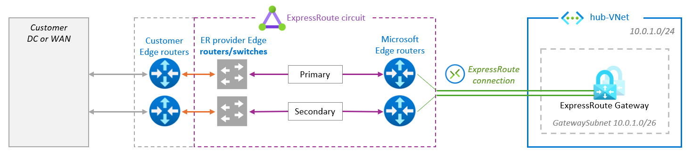
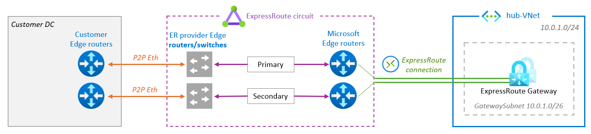
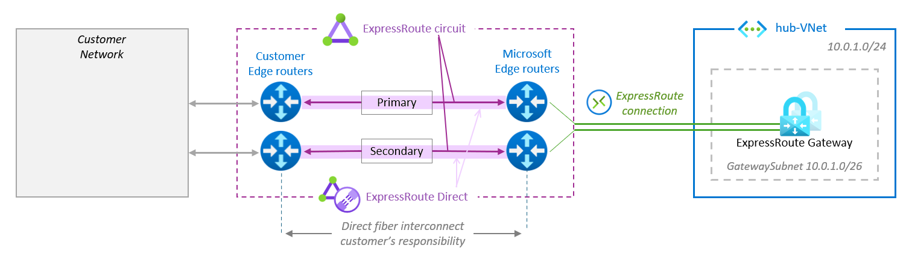

# Understanding ExpressRoute private peering to address ExpressRoute resiliency

No breaking news here, just an illustrated recap of the the recommendations and attention points highlighted here and there in the [Microsoft Expressroute documentation](https://learn.microsoft.com/en-us/azure/expressroute/).

# Scope

This article focuses on [ExpressRoute](https://learn.microsoft.com/en-us/azure/expressroute/expressroute-introduction) Private Peering only, used to connect an On-Prem network and VNets in an [Azure region](https://azure.microsoft.com/en-us/explore/global-infrastructure/geographies/#overview). ExpressRoute connectivity is provided in [ExpressRoute peering locations](https://learn.microsoft.com/en-us/azure/expressroute/expressroute-locations).

 ExpressRoute peering locations are entry points into the Microsoft backbone, Azure regions are where  the Azure resources are hosted: distinct concepts at different locations. 
 
# 1. ExpressRoute components

3 main components: the Circuit, the Gateway and the Connection.

| **Components** | **Connectivity** | **Location** |
|---|---|---|
|ExpressRoute Circuit|Dual physical fiber connectivity between the MSEEs and the provider|Expressroute peering location|
|ExpressRoute Gateway|Min 2 instances connected to both MSEEs| Azure region|
|ExpressRoute Connection|Virtual connection between the MSEE and the ExpressRoute Gateway|ExpressRoute location to Azure region

The provider must ensure redundant connectivity to either the customer edge or their MPLS edge.

# 2. ExpressRoute models

There are 4 [ExpressRoute connectivity models](https://learn.microsoft.com/en-us/azure/expressroute/expressroute-connectivity-models) between on-premises and Azure, divided in 2 approaches: 3 ExpressRoute *Service Provider* models and 1 ExpressRoute *Direct* model.

## 2.1. ExpressRoute Service Provider models

In these models, ExpressRoute connectivity is provided to customers through [service providers](https://learn.microsoft.com/en-us/azure/expressroute/expressroute-locations-providers#partners) and can be delivered in 3 different ways.

### Cloud exchange colocation

The customer edge routers are located **in a cloud exchange facility** near or at the peering location and are cross-connected with an ExpressRoute connectivity provider using either L2 or L3.

### Ethernet Point to Point

The customer edge routers **at a branch** are connected via point-to-point Ethernet links to an ExpressRoute connectivity provider, utilizing either L2 or L3.

### Any-to-any connectivity

In this scenario, ExpressRoute is associated with a **customer VRF** within the WAN provider network, making Azure appear as just any other branch connected to the customer's MPLS backbone. The routers of the ExpressRoute connectivity provider are cross-connected with colocated WAN service provider routers.

## 2.2. ExpressRoute Direct model

ExpressRoute Direct is a dedicated physical connection to the Microsoft backbone, established between a pair of MSEEs and customer routers, without any intermediate connecitivity provider. The customer is allocated an entire MSEE port (10Gbps and 100Gbps) allowing the creation of multiple circuits on it.

## 4. Prevent Service Provider Failure

## 5. Prevent MSEE maintenance impact

## 6. Prevent Availability Zone Failure
