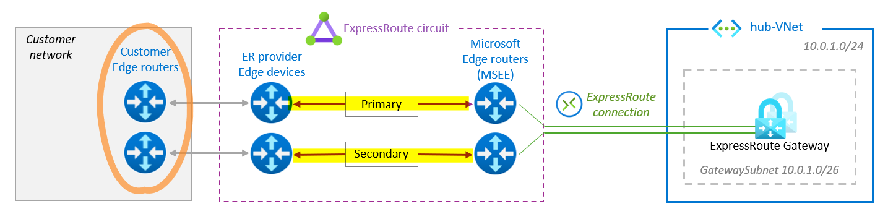

# Understanding ExpressRoute private peering to address ExpressRoute resiliency

> No breaking news here, just an illustrated recap of the the recommendations and attention points highlighted here and there in the [Microsoft Expressroute documentation](https://learn.microsoft.com/en-us/azure/expressroute/) as well as in this [video](https://www.youtube.com/watch?v=CuXOszhSWjc).

- [Scope](#scope)
- [1. ExpressRoute components](#1-expressroute-components)
- [2. ExpressRoute models](#2-expressroute-models)
  * [2.1. ExpressRoute Service Provider models](#21-expressroute-service-provider-models)
    + [Cloud exchange colocation](#cloud-exchange-colocation)
    + [Ethernet Point to Point](#ethernet-point-to-point)
    + [Any-to-any connectivity](#any-to-any-connectivity)
  * [2.2. ExpressRoute Direct model](#22-expressroute-direct-model)
- [3. Prevent Service Provider Failure](#3-prevent-service-provider-failure)
- [4. Prevent MSEE maintenance impact](#4-prevent-msee-maintenance-impact)
- [5. Prevent Availability Zone Failure](#5-prevent-availability-zone-failure)

# Scope

This article focuses on [ExpressRoute](https://learn.microsoft.com/en-us/azure/expressroute/expressroute-introduction) Private Peering only, used to connect an On-Prem network and VNets in an [Azure region](https://azure.microsoft.com/en-us/explore/global-infrastructure/geographies/#overview). ExpressRoute connectivity is provided in [ExpressRoute peering locations](https://learn.microsoft.com/en-us/azure/expressroute/expressroute-locations).

 ExpressRoute peering locations are entry points into the Microsoft backbone, Azure regions are where  the Azure resources are hosted: distinct concepts at different locations. 
 
# 1. ExpressRoute components

3 main components: the Circuit, the Gateway and the Connection.

| **Components** | **Connectivity** | **Location** |
|---|---|---|
|ExpressRoute Circuit|Dual physical fiber connectivity between the MSEEs and the provider equipments|Expressroute peering location|
|ExpressRoute Gateway|Min 2 instances connected to both MSEEs| Azure region|
|ExpressRoute Connection|Virtual connection between the MSEE and the ExpressRoute Gateway|ExpressRoute location to Azure region

The provider must ensure redundant connectivity to either the customer edge or their MPLS edge.

# 2. ExpressRoute models

There are 4 [ExpressRoute connectivity models](https://learn.microsoft.com/en-us/azure/expressroute/expressroute-connectivity-models) between on-premises and Azure, divided in 2 approaches: 3 ExpressRoute ***Service Provider*** models and 1 ExpressRoute ***Direct*** model.

## 2.1. ExpressRoute Service Provider models

In these models, ExpressRoute connectivity is provided to customers through [service providers](https://learn.microsoft.com/en-us/azure/expressroute/expressroute-locations-providers#partners) and can be delivered in 3 different ways.

### Cloud exchange colocation

The customer edge routers are located **in a cloud exchange facility** near or at the peering location and are cross-connected with an ExpressRoute connectivity provider using either L2 or L3.

### Ethernet Point to Point

The customer edge routers **at a branch** are connected via point-to-point Ethernet links to an ExpressRoute connectivity provider, utilizing either L2 or L3.

### Any-to-any connectivity

In this scenario, ExpressRoute is associated with a **customer VRF** within the WAN provider network, making Azure appear as just any other branch connected to the customer's MPLS backbone. The routers of the ExpressRoute connectivity provider are cross-connected with colocated WAN service provider routers.

## 2.2. ExpressRoute Direct model

[ExpressRoute Direct](https://learn.microsoft.com/en-us/azure/expressroute/expressroute-erdirect-about) is a dedicated physical connection to the Microsoft backbone, established between a pair of MSEEs and customer routers, without any intermediate connecitivity provider. The customer is allocated an entire MSEE port (10Gbps and 100Gbps) allowing the creation of multiple circuits on it.

Adam's [video](https://youtu.be/Yk5bFWhdVJg?si=tjix2A-ity2sLmjp) is another valuable resource for learning about ExpressRoute Direct.

# 3. What could go wrong?

## 3.1. ExpressRoute peering location failure

### Solution #1: geo-redundant ExpressRoute circuits

To address ExpressRoute peering location failures, the recommended solution is to build a resilient design as outlined in [this article](https://learn.microsoft.com/en-us/azure/expressroute/designing-for-disaster-recovery-with-expressroute-privatepeering) and illustrated below:

Resiliency is achieved by deploying 2 ExpressRoute circuits in 2 distinct ExpressRoute peering locations, thereby creating geo-redundant ExpressRoute circuits that are both connected to the same Azure ExpressRoute Gateway.

Based on this principle, multiple Azure region environments provide the opportunity to leverage existing ExpressRoute circuits to achieve geo-redundancy through an ***ExpressRoute Bow-Tie*** design:

:warning: Because this design introduces 2 parallel paths to Azure, traffic engineering mechanisms must be carefully implemented to prevent unexpected asymmetric routing.

### Solution #2: S2S VPN backup

ExpressRoute and VPN can also be combined in an active-passive configuration to provide disaster recovery capabilities. 

Both a VPN Gateway and an ExpressRoute Gateway can exist in the same GatewaySubnet.

Transit routing between the ExpressRoute Gateway and the VPN Gateway is not possible without the use of ARS or vWAN.

ExpressRoute routes take precedence over other routes for the same prefixes.

When different but overlapping prefixes are used, the route with the longest prefix is chosen.

## 3.2. On-Prem configurations/failures and MSEE maintenances

During an ExpressRoute circuit maintenance, one link out of the 2 fibers connecting the MSEEs and provider equipments remains available. AS-prepending is used by Microsoft to force traffic over the remaining link. 

To prevent conflicts between Microsoft AS-prepending and On-Prem routing and to maintain On-Prem network resiliency, it is important to plan for this scenario and operate both links of an ER circuit (highlighted in yellow) as [Active/Active](https://learn.microsoft.com/en-us/azure/expressroute/designing-for-high-availability-with-expressroute#active-active-connections) when in nominal mode.

To prevent a single point of failure, it also recommended to terminate the primary and the secondary links of an ExpressRoute circuit on 2 separate customer routers as highlighted in orange.

## 3.3. Prevent Availability Zone Failure
